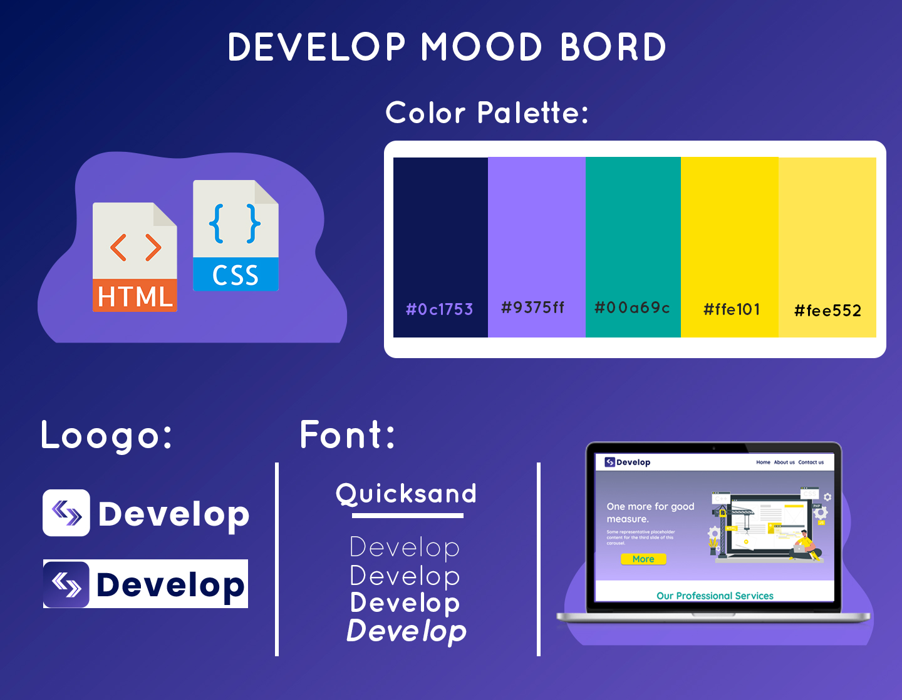

#  Develop Landig Page

## Technologies Used
* HTML
* CSS

## Mood Bord 

## Page Prototype
It's design by figme you can check it from here: 
<a href= 'https://www.figma.com/proto/sUorW4M7CYPh0XkbgHWTs8/Develop-Project?node-id=1%3A2'>Prototype</a>. 

# screenshot:

The Demo
Check out the demo page [here](http://127.0.0.1:5500/test1.html)
